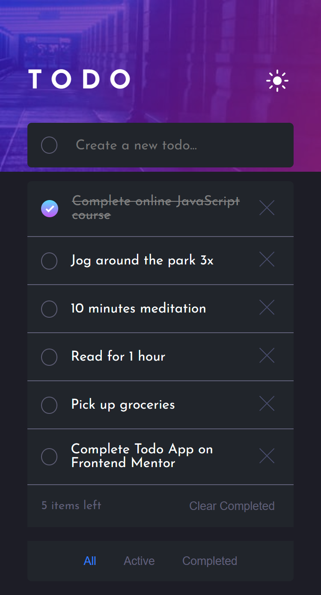
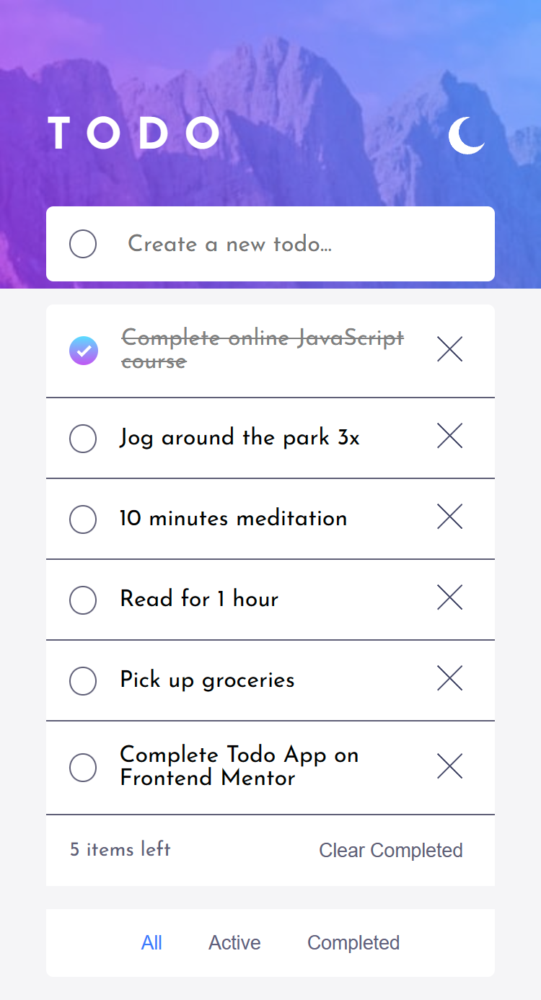
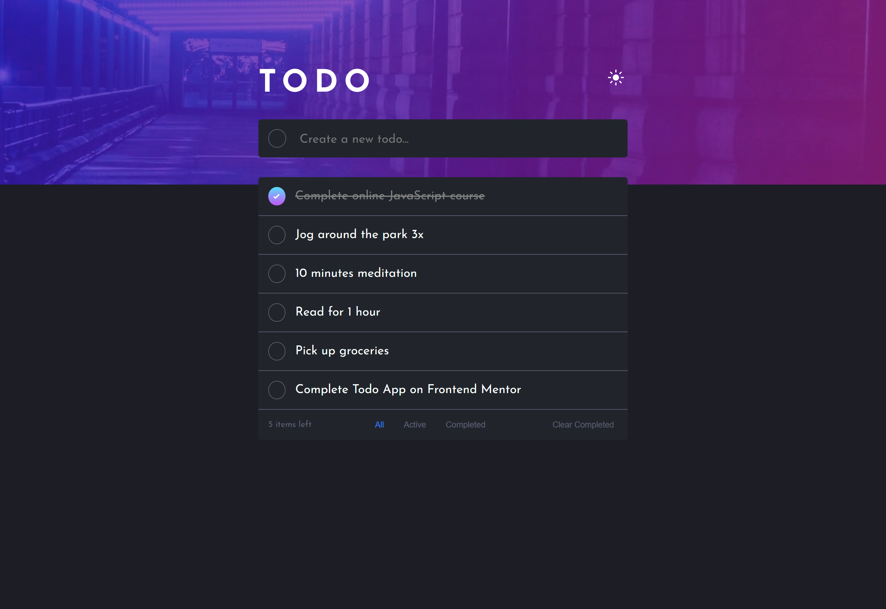
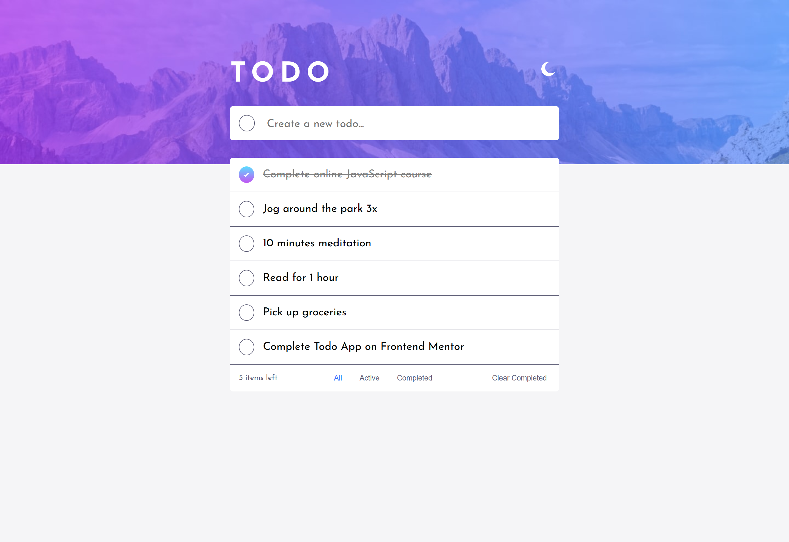

# Todo app solution

This is a solution to the [Todo app challenge on Frontend Mentor](https://www.frontendmentor.io/challenges/todo-app-Su1_KokOW). Frontend Mentor challenges help you improve your coding skills by building realistic projects. 

## Table of contents

- [Overview](#overview)
  - [The challenge](#the-challenge)
  - [Screenshot](#screenshot)
  - [Links](#links)
- [My process](#my-process)
  - [Built with](#built-with)
  - [What I learned](#what-i-learned)
- [Author](#author)

## Overview

### The challenge

Users should be able to:

- View the optimal layout for the app depending on their device's screen size
- See hover states for all interactive elements on the page
- Add new todos to the list
- Mark todos as complete
- Delete todos from the list
- Filter by all/active/complete todos
- Clear all completed todos
- Toggle light and dark mode
- **Bonus**: Drag and drop to reorder items on the list

### Screenshots

| Mobile Dark      | Mobile Light     |
| -----------------|------------------|
| |  |

## Desktop Dark

## Desktop Light

### Links

- Solution URL: [Repository](https://github.com/luccas-fialho/react-todo-app)
- Live Site URL: [Todo App](https://react-todo-app-vert-omega.vercel.app/)

## My process

### Built with

- [React](https://reactjs.org/) - JS library
- Mobile-first workflow
- Semantic HTML5 markup
- CSS custom properties
- CSS media queries
- Flexbox

### What I learned

This was my first React project. I've worked with Angular before so I brought some concepts from there, with this and some youtube tutorials I was able to do what was meant to. 

One thing that was hard for me in this project was the conditional styles I had to apply to each component (or all of them) like the background images depending on the screen size, the dark mode and the checkboxes when a task is done.

I learned some React concepts like UseState hook and component syntax.

## Author

- Website - [Portfolio](https://luccas-fialho.github.io/portfolio/)
- Frontend Mentor - [@luccas-fialho](https://www.frontendmentor.io/profile/luccas-fialho)
